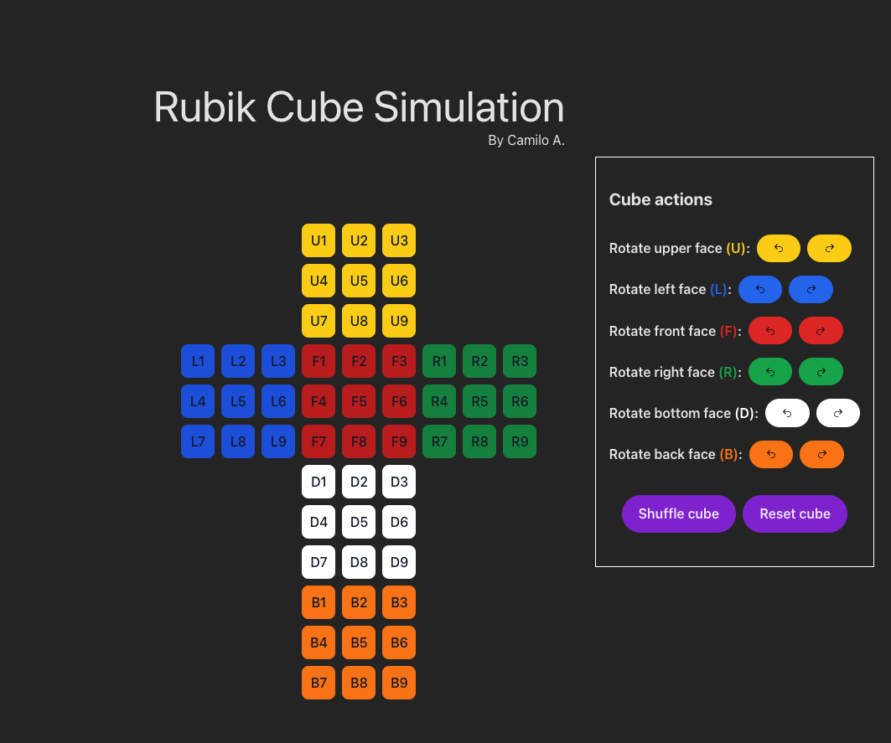

# Rubik Cube Simulation

This is a simulation of a Rubik Cube. Permutating around the different states of the cube
and showing the states as an abstraction of the Rubik Cube.

## How to run?

The project was built using react + typescript + vite + tailwind:

- Run `yarn` to install the packages
- Run `yarn dev` to start the local server
- Have fun playing with the cube
